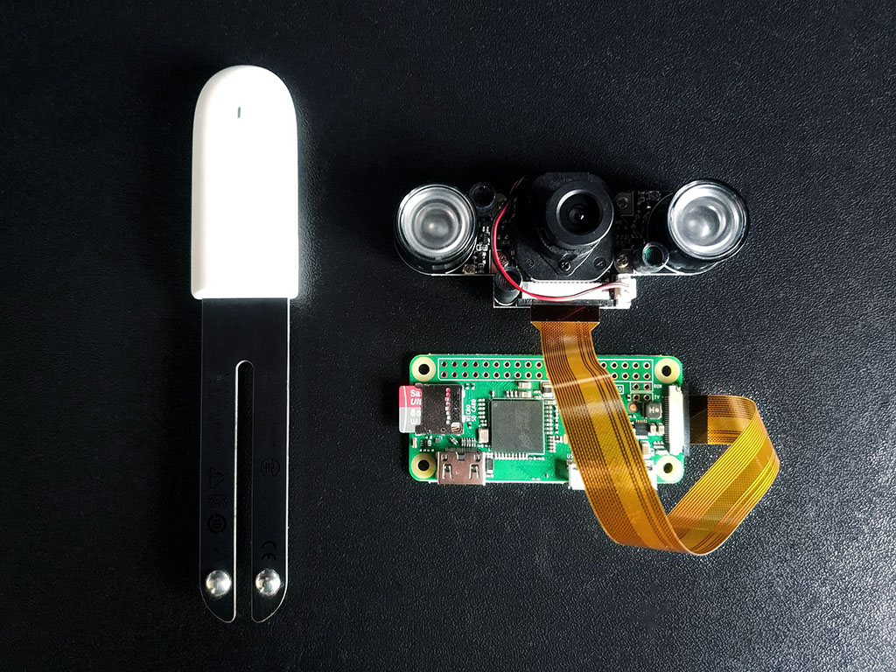

MiFlora Raspberry Gateway - FrontEnd
-----------------------------------

The backend I use for the MiFlora Raspberry Gateway.

Requirements:

- MiFlora sensor
- Raspberry Pi Zeo W
- Raspberry Pi camera module
- Miflora Mqtt Daemon
- NodeJs
- PM2
- Backend API

